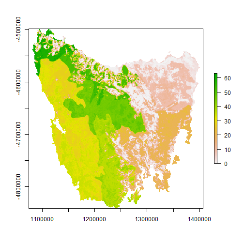
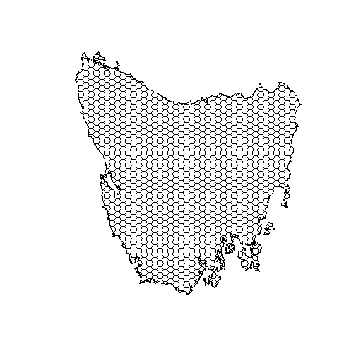
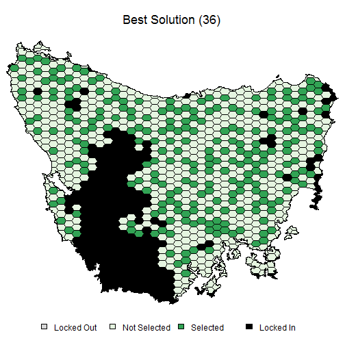
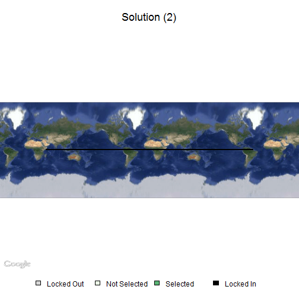
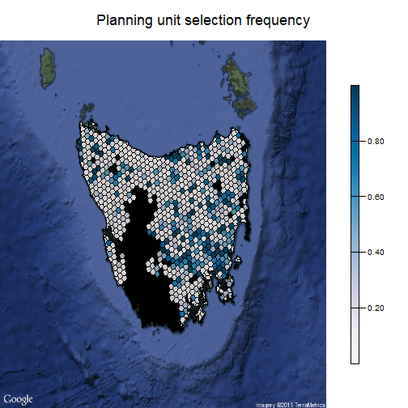
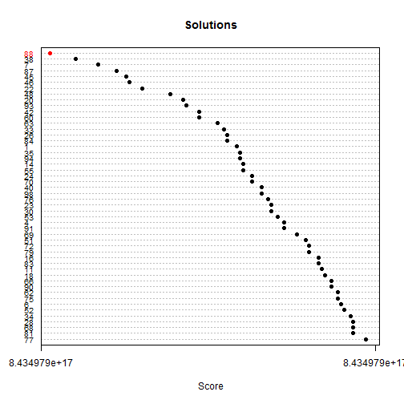
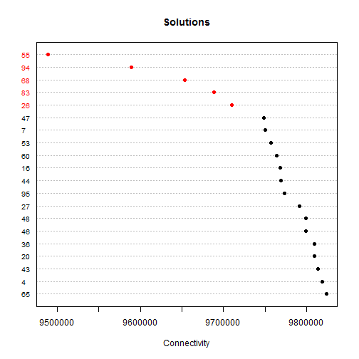

marxan quick start guide
============

First, let's load the 'marxan' R package and some example data.


```r
# load marxan R package
library(marxan)
```

```
## Loading required package: sp
## Loading required package: rgdal
## rgdal: version: 0.9-1, (SVN revision 518)
## Geospatial Data Abstraction Library extensions to R successfully loaded
## Loaded GDAL runtime: GDAL 1.11.1, released 2014/09/24
## Path to GDAL shared files: C:/R/R-3.1.2/library/rgdal/gdal
## GDAL does not use iconv for recoding strings.
## Loaded PROJ.4 runtime: Rel. 4.8.0, 6 March 2012, [PJ_VERSION: 480]
## Path to PROJ.4 shared files: C:/R/R-3.1.2/library/rgdal/proj
## Loading required package: raster
## 
## Attaching package: 'marxan'
## 
## The following objects are masked from 'package:stats':
## 
##     dist, hclust
## 
## The following object is masked from 'package:graphics':
## 
##     dotchart
```

```r
# load example data
data(taspu, tasinvis)
```

This data comes from the ['Introduction to Marxan'](http://marxan.net/courses.html). `taspu` is a `SpatialPolygonsDataFrame` object that contains our planning units, and `tasinvis` is a `RasterLayer` that contains distribution data for 63 broad vegetation classes. Let's take a look at the data.


```r
# plot planning units
plot(taspu)
```

 

```r
# plot vegetation data
plot(tasinvis)
```

 

Each planning unit in the `taspu` object is associated with an id, an acquisition cost, and a value indicating if the most of the unit is already locked up in protected areas. This information is stored in the `data` slot.


```r
# print data in the attribute table for first 20 planning units
head(taspu@data)
```

```
##   id     cost status
## 2  1 60.24638      0
## 3  2 19.86301      0
## 4  3 59.68051      0
## 5  4 32.41614      0
## 6  5 26.17706      0
## 7  6 51.26218      0
```

```r
# plot planning units with colours indicating cost
spplot(taspu, 'cost')
```

 

```r
# plot planning units with colors indicating status
# units with a status of 2 have most of their area in IUCN protected areas,
# otherwise they have a status of 0
spplot(taspu, 'status')
```

 

Now, let's make some reserve systems.


```r
# the NUMREPS=100L parameter tells marxan to generate 100 candidate reserve systems
# the BLM=0 parameter indicates that fragmented prioritisations incur no additional penalties
results<-marxan(taspu, tasinvis, targets="50%", NUMREPS=100L, BLM=0)
```

Well, that was easy. Apparently it worked? All we see is text. How can visualise these solutions and assess their quality? We can make some geoplots.


```r
## make a geoplot of the best solution
plot(results, 0)
```

 

```r
## make a geoplot of the second solution
# let's also add a kickass google map background
# and make the planning unit colours transparent.
plot(results, 2, basemap='satellite', alpha=0.8)
```

```
## Loading required package: PBSmapping
## 
## -----------------------------------------------------------
## PBS Mapping 2.67.60 -- Copyright (C) 2003-2013 Fisheries and Oceans Canada
## 
## PBS Mapping comes with ABSOLUTELY NO WARRANTY;
## for details see the file COPYING.
## This is free software, and you are welcome to redistribute
## it under certain conditions, as outlined in the above file.
## 
## A complete user guide 'PBSmapping-UG.pdf' is located at 
## C:/R/R-3.1.2/library/PBSmapping/doc/PBSmapping-UG.pdf
## 
## Packaged on 2014-03-27
## Pacific Biological Station, Nanaimo
## 
## All available PBS packages can be found at
## http://code.google.com/p/pbs-software/
## 
## To see demos, type '.PBSfigs()'.
## -----------------------------------------------------------
```

 

```r
## make a geoplot of planning unit selection frequencies
# planning units with darker colours were more often
# selected for protection than those with lighter colours.
plot(results, basemap='satellite', alpha=0.8)
```

 

We have one hundred solutions. How can we compare them? We don't want to make 100 maps; while they are pretty, they're not that pretty. Instead, we could make some dotcharts that let us compare various properties of the solutions.


```r
# make dotchart showing the score of each solution
# the score describes the overall value of the prioritisations based on our criteria
# the lower the value, the better the solution
# the best solution is coloured in red.
dotchart(results, var='score')
```

 

```r
# make a dotchart showing the connectivity of the solutions
# the connectivity describes how clustered the selected planning units are
# a prioritisation with lots of planning units close together will have a low value
# whereas a fragmented prioritisation will have a high value
# we can specify arguments to limit the plot to the solutions in with the top 20
# connectivity vlaues, and colour the best 5 in red.
dotchart(results, var='con', nbest=5, n=20)
```

 

How can we visualise the main components of variation in the solutions? In other words, how can we visualise the key differences and commonalities between the solutions? For instance, we would want to know if the all the solutions are very similar, or if they fall into several key groups. If they all fall into several groups, this means we don't have to look at all the solutions. Instead, we can look at some of the best solutions in each group to decide which candidate reserve system is the best. 

But how can we do this? Fortunately, statisticians solved this problem a long time ago. We can use ordination techniques to create a few variables that describe commonalities among the solutions, and visualise the main sources of variation in a manageable number of dimensions.


