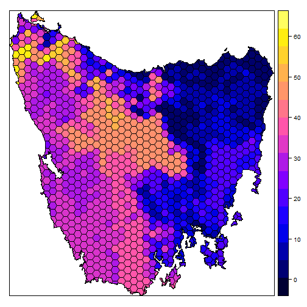
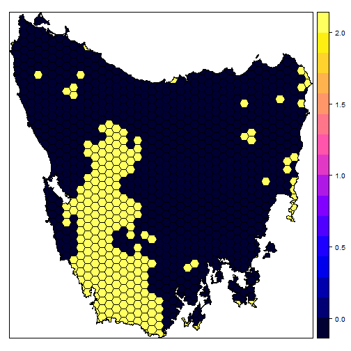

marxan quick start guide
============

First, let's load the 'marxan' R package and some example data.


```r
# load marxan R package
library(marxan)

# load example data
data(taspu, tasinvis)
```

This data comes from the ['Introduction to Marxan'](http://marxan.net/courses.html). `taspu` is a `SpatialPolygonsDataFrame` object that contains our planning units, and `tasinvis` is a `RasterLayer` that contains distribution data for 63 broad vegetation classes. Let's take a look at the data.


```r
# plot planning units
plot(taspu)
```

 

```r
# plot vegetation data
plot(tasinvis)
```

 

Each planning unit in the `taspu` object is associated with an id, an acquisition cost, and a value indicating if the most of the unit is already locked up in protected areas. This information is stored in the `data` slot.


```r
# print data in the attribute table for first 20 planning units
head(taspu@data)
```

```
##   id     cost status
## 2  1 60.24638      0
## 3  2 19.86301      0
## 4  3 59.68051      0
## 5  4 32.41614      0
## 6  5 26.17706      0
## 7  6 51.26218      0
```

```r
# plot planning units with colours indicating cost
spplot(taspu, 'cost')
```

 

```r
# plot planning units with colors indicating status
# units with a status of 2 have most of their area in IUCN protected areas,
# otherwise they have a status of 0
spplot(taspu, 'status')
```

 

Now, let's make some reserve systems.


